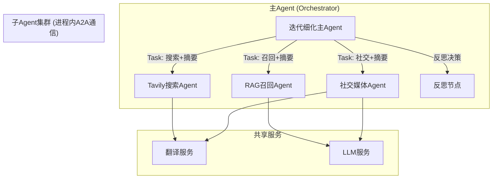
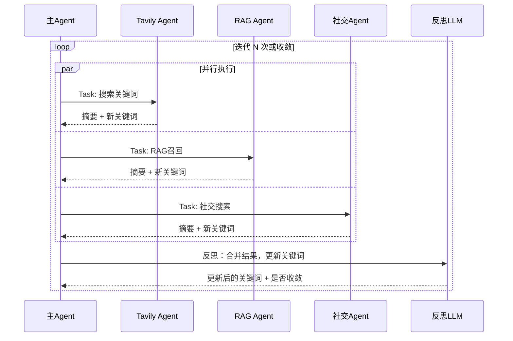

# 迭代细化节点 A2A 多Agent架构设计

本文档是 PulseGlobe 蓝图 **1.2 迭代细化节点** 的详细设计文档，采用主Agent + 子Agent + A2A协议的架构。

## 架构概述



### 设计决策

| 决策项 | 选择 | 说明 |
|--------|------|------|
| **部署模式** | 进程内模式 | 所有Agent在同一进程，通过内存通信 |
| **A2A SDK** | 官方 `a2a-sdk` | `pip install a2a-sdk` |
| **翻译服务** | 讯蒙 Tengri API | 支持蒙古语，可灵活切换 |

---

## A2A 协议集成

> [!IMPORTANT]
> **A2A 与 MCP 的分工**
> - **MCP**：Agent 与外部工具/资源的交互（如调用 Tavily API、TikHub API）
> - **A2A**：Agent 与 Agent 之间的协作通信

### 子Agent职责

| Agent | 职责 | 内部流程 |
|-------|------|----------|
| **Tavily搜索Agent** | 网页搜索+处理 | 搜索 → 语言检测 → 翻译(可选) → 摘要 |
| **RAG召回Agent** | 向量库召回+处理 | 召回 → 相关性过滤 → 摘要 |
| **社交媒体Agent** | MCP社交数据+处理 | MCP调用 → 语言检测 → 翻译(可选) → 摘要 |

### 进程内A2A通信

```python
# 进程内模式：直接通过内存调用，无需HTTP
from a2a import InProcessA2AClient, InProcessA2AServer

class OrchestratorAgent:
    def __init__(self):
        # 注册子Agent（进程内）
        self.tavily_agent = TavilyWorkerAgent()
        self.rag_agent = RAGWorkerAgent()
        self.social_agent = SocialWorkerAgent()
        
        self.client = InProcessA2AClient()
        self.client.register(self.tavily_agent)
        self.client.register(self.rag_agent)
        self.client.register(self.social_agent)

    async def refine(self, keywords: dict):
        # 并行调用所有子Agent
        tasks = await asyncio.gather(
            self.client.send_task(self.tavily_agent, keywords),
            self.client.send_task(self.rag_agent, keywords),
            self.client.send_task(self.social_agent, keywords),
        )
        return tasks
```

---

## 迭代细化流程（A2A版）



### 收敛判断逻辑

```python
def check_convergence(old_keywords: set, new_keywords: set, threshold: float = 0.1):
    """判断关键词列表是否收敛"""
    new_count = len(new_keywords - old_keywords)
    total_count = len(new_keywords)
    
    # 新增关键词占比 < 阈值时认为收敛
    return (new_count / max(total_count, 1)) < threshold
```

---

## 文件结构

```
pulseglobe/
├── a2a/                           # A2A 协议相关
│   ├── __init__.py
│   ├── client.py                  # 进程内A2A客户端封装
│   └── base_agent.py              # A2A Agent基类
│
├── agents/
│   ├── orchestrator/              # 主Agent
│   │   ├── __init__.py
│   │   ├── agent.py               # 迭代细化主Agent
│   │   └── reflection.py          # 反思逻辑
│   │
│   └── workers/                   # 子Agent
│       ├── __init__.py
│       ├── base_worker.py         # 子Agent基类
│       ├── tavily_agent.py        # Tavily搜索子Agent
│       ├── rag_agent.py           # RAG召回子Agent
│       └── social_agent.py        # 社交媒体子Agent
│
└── services/
    └── translation/               # 翻译服务（可插拔）
        ├── __init__.py
        ├── base.py                # 翻译服务抽象基类
        ├── xmor.py                # 讯蒙 Tengri API
        ├── llm.py                 # 使用LLM翻译
        └── factory.py             # 翻译服务工厂
```

---

## 翻译服务抽象层

> [!TIP]
> 翻译服务采用可插拔设计，支持灵活切换提供商，不与系统耦合

### 配置文件

```yaml
# config/models.yaml

translation:
  provider: "xmor"  # xmor / llm / baidu / google
  api_key: "${XMOR_API_KEY}"
  base_url: "https://api.xmor.cn"
```

### 抽象基类

```python
# pulseglobe/services/translation/base.py

from abc import ABC, abstractmethod
from typing import Optional

class BaseTranslationService(ABC):
    """翻译服务抽象基类"""
    
    @abstractmethod
    async def translate(
        self, 
        text: str, 
        source_lang: Optional[str] = None,
        target_lang: str = "zh"
    ) -> str:
        """翻译文本"""
        pass
    
    @abstractmethod
    async def detect_language(self, text: str) -> str:
        """检测文本语言"""
        pass
    
    async def translate_if_needed(
        self, 
        text: str, 
        target_lang: str = "zh"
    ) -> tuple[str, bool]:
        """如果不是目标语言则翻译"""
        detected = await self.detect_language(text)
        if detected == target_lang:
            return text, False
        translated = await self.translate(text, detected, target_lang)
        return translated, True
```

### 讯蒙 Tengri API 实现

```python
# pulseglobe/services/translation/xmor.py

import httpx

class XmorTranslationService(BaseTranslationService):
    """讯蒙科技 Tengri API 翻译服务"""
    
    def __init__(self, api_key: str, base_url: str = "https://api.xmor.cn"):
        self.api_key = api_key
        self.base_url = base_url
        self.client = httpx.AsyncClient(
            headers={"Authorization": f"Bearer {api_key}"}
        )
    
    async def translate(
        self, 
        text: str, 
        source_lang: Optional[str] = None,
        target_lang: str = "zh"
    ) -> str:
        response = await self.client.post(
            f"{self.base_url}/v1/translate",
            json={
                "text": text,
                "source": source_lang,
                "target": target_lang
            }
        )
        return response.json()["translation"]
    
    async def detect_language(self, text: str) -> str:
        # 简单实现：检测是否包含中文/蒙古文字符
        import re
        if re.search(r'[\u4e00-\u9fff]', text):
            return "zh"
        if re.search(r'[\u1800-\u18AF]', text):  # 蒙古文
            return "mn"
        return "en"  # 默认英文
```

### 翻译服务工厂

```python
# pulseglobe/services/translation/factory.py

def create_translation_service(config: dict) -> BaseTranslationService:
    """创建翻译服务实例"""
    provider = config.get("provider", "xmor")
    
    if provider == "xmor":
        from .xmor import XmorTranslationService
        return XmorTranslationService(
            api_key=config["api_key"],
            base_url=config.get("base_url", "https://api.xmor.cn")
        )
    elif provider == "llm":
        from .llm import LLMTranslationService
        return LLMTranslationService(config)
    elif provider == "baidu":
        from .baidu import BaiduTranslationService
        return BaiduTranslationService(config)
    else:
        raise ValueError(f"Unsupported translation provider: {provider}")
```

---

## 环境变量

```bash
# .env 补充

# 讯蒙 Tengri API
XMOR_API_KEY=sk-5TmpTnEb25y9hCm9AMHRPi6afvLA7MF9U331lPs6Xy61ltLH
```

---

## 子Agent实现示例

### 基类

```python
# pulseglobe/agents/workers/base_worker.py

from a2a import A2AAgent, Task, TaskResult
from pulseglobe.services.translation import BaseTranslationService

class BaseWorkerAgent(A2AAgent):
    """子Agent基类"""
    
    def __init__(self, translator: BaseTranslationService, llm_client):
        self.translator = translator
        self.llm = llm_client
    
    async def handle_task(self, task: Task) -> TaskResult:
        # 1. 解析输入
        keywords = task.message.data.get("keywords", [])
        
        # 2. 执行搜索（子类实现）
        raw_results = await self.search(keywords)
        
        # 3. 翻译外文内容
        processed = await self._translate_results(raw_results)
        
        # 4. 生成摘要
        summary = await self._summarize(processed)
        
        # 5. 提取新关键词
        new_keywords = await self._extract_keywords(processed)
        
        return TaskResult(
            status="completed",
            data={
                "summary": summary,
                "results": processed,
                "new_keywords": new_keywords
            }
        )
    
    async def _translate_results(self, results: list) -> list:
        for item in results:
            text = item.get("content") or item.get("text", "")
            translated, was_translated = await self.translator.translate_if_needed(text)
            if was_translated:
                item["original_text"] = text
                item["content"] = translated
        return results
```

### Tavily搜索Agent

```python
# pulseglobe/agents/workers/tavily_agent.py

class TavilyWorkerAgent(BaseWorkerAgent):
    
    def __init__(self, tavily_client, translator, llm):
        super().__init__(translator, llm)
        self.tavily = tavily_client
    
    async def search(self, keywords: list) -> list:
        results = []
        for kw in keywords:
            search_results = await self.tavily.search(kw, max_results=5)
            results.extend(search_results)
        return results
```

---

## 技术栈汇总

| 组件 | 选型 | 版本/说明 |
|------|------|----------|
| **A2A 协议** | `a2a-sdk` | 官方Python SDK |
| **部署模式** | 进程内 | 单进程，内存通信 |
| **翻译服务** | 讯蒙 Tengri | 可切换其他提供商 |
| **异步框架** | asyncio | Python原生 |
| **HTTP客户端** | httpx | 异步HTTP请求 |
