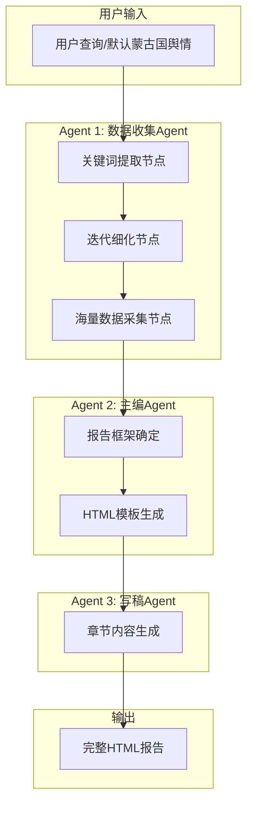
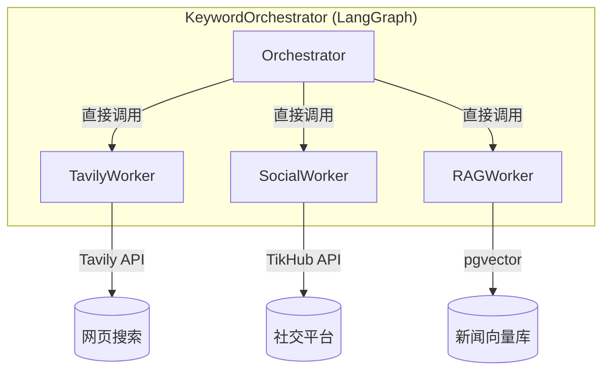
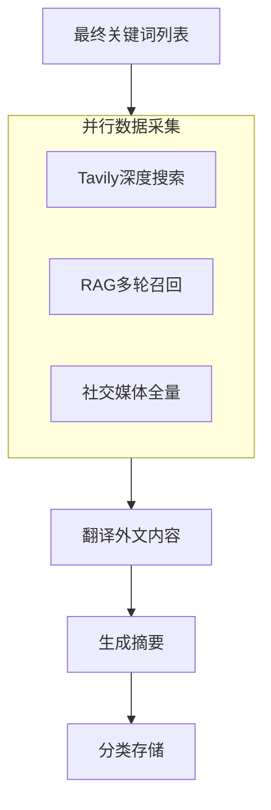

# PulseGlobe 跨境舆情分析智能体系统蓝图

## 概述

本文档是蒙古国跨境舆情分析多Agent系统的架构蓝图。



---

## 阶段一：关键词感知（已完成）

> [!IMPORTANT]
> 当前实现使用 **LangGraph 进程内调度**，不使用 A2A 协议

### 架构概览



### 实现文件结构

```
pulseglobe/
├── config/
│   └── settings.yaml          # 统一配置文件
├── core/
│   └── config.py              # 配置加载器
├── services/
│   └── llm.py                 # LLM 客户端
└── agents/
    ├── state.py               # 状态定义 (KeywordState)
    ├── prompts.py             # Prompt 模板
    ├── orchestrator.py        # 主协调器 (LangGraph)
    └── workers/
        ├── base.py            # Worker 基类
        ├── tavily_worker.py   # Tavily 搜索
        ├── rag_worker.py      # RAG 向量检索
        └── social_worker.py   # 社交媒体搜索
```

### 核心设计特点

| 特性 | 说明 |
|------|------|
| **交叉关键词更新** | 每个渠道的结果都更新三类关键词列表 |
| **防离题约束** | Prompt 强调与原始问题相关、具体优先 |
| **收敛检测** | 新增关键词占比 < 10% 时停止迭代 |
| **蒙古语支持** | 西里尔字母蒙古语 + 英语 |

### 为什么不用 A2A？

| 进程内调用（当前） | A2A 协议 |
|-------------------|----------|
| ✅ 简单直接 | 需要服务部署 |
| ✅ 共享内存状态 | HTTP/gRPC 通信 |
| ✅ 适合单机开发 | 适合分布式部署 |
| ✅ 调试方便 | 服务隔离 |

**结论**：当前阶段验证逻辑为主，进程内调用足够。后期如需分布式部署可升级到 A2A。

---

## 阶段二：海量数据采集（待实现）

使用阶段一产出的关键词列表，进行全量数据采集：



此阶段需要：
- 翻译服务（讯蒙 Tengri API）
- 数据摘要生成
- 结果存储

---

## 阶段三：报告生成（待实现）

包含主编Agent和写稿Agent。

---

## 技术栈

| 组件 | 选型 | 状态 |
|------|------|------|
| **Agent框架** | LangGraph | ✅ 已使用 |
| **进程内调度** | 直接函数调用 | ✅ 已实现 |
| **向量数据库** | PostgreSQL + pgvector | ✅ 已集成 |
| **Embedding** | Qwen3-Embedding-4B (2560维) | ✅ 已配置 |
| **网页搜索** | Tavily API | ✅ 已集成 |
| **社交数据** | TikHub API (直接调用) | ✅ 已集成 |
| **翻译服务** | 讯蒙 Tengri | ⏳ 阶段二 |
| **A2A 协议** | 暂不使用 | ➖ 可选升级 |

---

## 配置文件

### config/settings.yaml

```yaml
database:
  host: "${DB_HOST:111.91.20.199}"
  port: 5432
  name: "${DB_NAME:news_db}"
  table: "pulseglobe_news"

llm:
  model: "deepseek-ai/DeepSeek-V3"
  base_url: "https://api.siliconflow.cn/v1"

embedding:
  model: "Qwen/Qwen3-Embedding-4B"
  dimensions: 2560

tavily:
  api_key: "${TAVILY_API_KEY}"

tikhub:
  api_token: "${TIKHUB_API_TOKEN}"
  base_url: "${TIKHUB_BASE_URL:https://api.tikhub.io}"
```

---

## 运行测试

```bash
# 测试 Workers
uv run python tests/test_workers.py

# 测试 Orchestrator
uv run python tests/test_orchestrator.py
```
